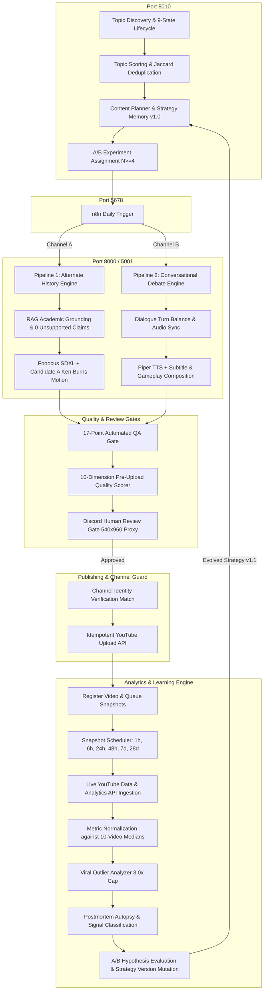

# YouTube Automation & Content Intelligence System: Master Context, Architecture & Implementation Report

**Repository Root:** `d:\Projects\yt-automations`  
**Active Branch:** `feature/growth-intelligence` (Commit: `4cc2e12`)  
**Status:** **100% Automated Test & Integration Verified (Master Suite: 21/21 PASS | Growth Suite: 42/42 PASS)**  
**Verdict:** **READY WITH OPERATOR ACTION (One-time Browser OAuth Authorization)**  

---

## 📑 Table of Contents
1. [Executive Summary & Full Project Context](#1-executive-summary--full-project-context)
2. [High-Level Topology & Architecture Diagrams](#2-high-level-topology--architecture-diagrams)
3. [Exhaustive File-by-File Inventory & Source Map](#3-exhaustive-file-by-file-inventory--source-map)
4. [Detailed Breakdown of Core Subsystems](#4-detailed-breakdown-of-core-subsystems)
   - 4.1. Pipeline 1: Alternate History Shorts (`alternate-history-shorts/`)
   - 4.2. Pipeline 2: Conversational Debate Shorts (`convo-shorts/`)
   - 4.3. Growth Core Database & Hot Backup Engine (`growth/db/`)
   - 4.4. Channel Separation & Identity Guard (`growth/channels/`)
   - 4.5. Pre-Publication Feature Extraction (`growth/features/`)
   - 4.6. Live YouTube Data API & Analytics API Ingestion (`growth/analytics/`)
   - 4.7. Snapshot Scheduler & Crash Recovery (`growth/analytics/`)
   - 4.8. Metric Normalization & Viral Outlier Protection (`growth/analytics/`)
   - 4.9. Topic Scoring, Lifecycle & Anti-Repetition Guard (`growth/topic_engine/`)
   - 4.10. Controlled A/B Experimentation Engine (`growth/experiments/`)
   - 4.11. Learning Engine, Autopsies & Strategy Mutation (`growth/learning/`)
   - 4.12. Autonomous Content Planner (`growth/planner/`)
   - 4.13. 10-Dimension Pre-Upload Quality Scorer (`growth/quality/`)
   - 4.14. n8n REST API Bridge Server (`growth/server.py`)
   - 4.15. Observability Terminal Dashboard (`growth/cli.py`)
5. [Complete Verification Suite & Test Evidence](#5-complete-verification-suite--test-evidence)
6. [Current Production State: Real vs. Simulated vs. Operator Action](#6-current-production-state-real-vs-simulated-vs-operator-action)
7. [Future Implementation Roadmap & Strategic Options](#7-future-implementation-roadmap--strategic-options)
8. [Operator Startup Runbook](#8-operator-startup-runbook)

---

## 1. Executive Summary & Full Project Context

### 1.1 The Mission
The objective of this repository is to build, deploy, and operate a fully automated, production-grade, two-channel YouTube Shorts media powerhouse equipped with an external **Content Intelligence and Closed-Loop Learning System**. 

The system does not simply publish mass-produced AI videos. Instead, it enforces strict academic and factual grounding, 17-point quality gates, mandatory Discord human approval, pre-upload channel identity verification, live YouTube Data/Analytics API ingestion, multi-window snapshot tracking (`1h`, `6h`, `24h`, `48h`, `7d`, `28d`), and statistical hypothesis learning ($N \ge 4$) to evolve content strategy over time.

### 1.2 The Trajectory & Key Historical Milestones
1. **Pipeline 1 Hardening & Production Freeze (`alternate-history-shorts`):**
   - Built a complete counterfactual history video generation engine with Ollama/RAG v4 academic grounding across arXiv/OpenAlex, 0 unsupported claims verification, Whisper audio alignment, Fooocus SDXL cinematic image generation, and FFmpeg video assembly.
   - Evaluated still-image motion algorithms and conducted a rigorous A/B test. Formally froze **Candidate A (8% linear Ken Burns camera motion)** as the canonical, jitter-free visual standard.
   - Built a 17-point automated QA gate and Discord review webhook before upload.
2. **Pipeline 2 Hardening & Production Freeze (`convo-shorts`):**
   - Built a split-screen conversational debate video generator featuring dual synthetic Piper voices (Adam and Brian), dynamic subtitle styling, and background gameplay composition with QA gates and Discord review.
3. **Channel Separation Strategy:**
   - Isolated two independent media brands:
     * **Channel A:** *Chronos Shift* (`@ChronosShiftAI`) — Alternate history, historical what-if counterfactuals.
     * **Channel B:** *Debate Protocol* (`@DebateProtocol`) — Psychology, AI dilemmas, philosophical paradoxes, debates.
   - Established strict channel configs in `config/channels/` and created `channel_identity_check.py` to abort uploads if the authenticated channel ID does not match the configured destination.
4. **Content Intelligence & Growth Engine (`growth/`):**
   - Built an external relational data layer (`growth.db`), feature extractors (16+ parameters per video), YouTube API collectors, 10-video median normalizers, 9-state topic lifecycles, single-variable A/B experiments, autopsy postmortems, strategy versioning (`strategy_v1.0` $\to$ `strategy_v1.1`), online hot backups, anti-repetition guards, and an n8n REST bridge on Port 8010.

---

## 2. High-Level Topology & Architecture Diagrams

### 2.1 Complete Closed-Loop Growth Lifecycle



---

## 3. Exhaustive File-by-File Inventory & Source Map

### 3.1 Growth System Package (`growth/`)

| File Path | Purpose & Responsibilities |
|---|---|
| [`growth/__init__.py`](file:///d:/Projects/yt-automations/growth/__init__.py) | Package initialization and module namespace exports. |
| [`growth/server.py`](file:///d:/Projects/yt-automations/growth/server.py) | **REST API Bridge on Port 8010**. Exposes `/health`, `GET /api/growth/plan-next`, `POST /api/growth/record-upload`, `POST /api/growth/run-learning-cycle`, and `GET /api/growth/dashboard` for n8n and CLI consumers. |
| [`growth/cli.py`](file:///d:/Projects/yt-automations/growth/cli.py) | **Master Operations CLI**. Handles `--init-db`, `--dashboard` (ASCII terminal metrics), `--plan-next`, `--run-learning`, `--check-snapshots`, and `--dry-run-loop`. |
| [`growth/run_growth_tests.py`](file:///d:/Projects/yt-automations/growth/run_growth_tests.py) | **Automated Test Discovery Runner**. Executes all 42 growth unit tests across database, analytics, experiments, learning, quality, and server modules. |

#### Database Layer (`growth/db/`)
| File Path | Purpose & Responsibilities |
|---|---|
| [`growth/db/schema.sql`](file:///d:/Projects/yt-automations/growth/db/schema.sql) | DDL defining relational SQLite schema with WAL mode, foreign keys, and 9 tables (`channels`, `videos`, `video_features`, `performance_snapshots`, `topic_candidates`, `experiments`, `strategy_versions`, `learning_events`, `jobs`). |
| [`growth/db/database.py`](file:///d:/Projects/yt-automations/growth/db/database.py) | Thread-safe context-managed SQLite connection manager (`get_db`) and schema initializer (`init_db`). |
| [`growth/db/models.py`](file:///d:/Projects/yt-automations/growth/db/models.py) | Python dataclasses (`ChannelModel`, `VideoModel`, `VideoFeaturesModel`, `PerformanceSnapshotModel`, `JobModel`) and `GrowthRepository` CRUD methods with conflict-safe upserts. |
| [`growth/db/backup.py`](file:///d:/Projects/yt-automations/growth/db/backup.py) | **Hot Backup Engine**. Uses SQLite's online backup API (`conn.backup()`) to create timestamped backups without blocking active WAL transactions, with rolling 10-backup retention and disaster recovery. |

#### Channels & Identity Layer (`growth/channels/`)
| File Path | Purpose & Responsibilities |
|---|---|
| [`growth/channels/channel_identity_check.py`](file:///d:/Projects/yt-automations/growth/channels/channel_identity_check.py) | Pre-upload channel identity validator. Asserts authenticated Google Channel ID matches `config/channels/` profile; mismatch immediately triggers fatal `RuntimeError`. |

#### Feature Extraction Layer (`growth/features/`)
| File Path | Purpose & Responsibilities |
|---|---|
| [`growth/features/schema.py`](file:///d:/Projects/yt-automations/growth/features/schema.py) | Standardized schema dictionary defining 16+ measurable video characteristics (hook score, scene cadence, visual change rate, motion intensity, caption density, controversy level). |
| [`growth/features/feature_extractor_p1.py`](file:///d:/Projects/yt-automations/growth/features/feature_extractor_p1.py) | Parses Pipeline 1 manifests, RAG evidence packets, Whisper timing JSONs, and Ken Burns scene plans into pre-publication feature vectors. |
| [`growth/features/feature_extractor_p2.py`](file:///d:/Projects/yt-automations/growth/features/feature_extractor_p2.py) | Parses Pipeline 2 scripts, dual-speaker line balances, turn lengths, and gameplay categories into pre-publication feature vectors. |

#### Analytics & Snapshot Layer (`growth/analytics/`)
| File Path | Purpose & Responsibilities |
|---|---|
| [`growth/analytics/youtube_api_collector.py`](file:///d:/Projects/yt-automations/growth/analytics/youtube_api_collector.py) | **Live YouTube API Ingestion Engine**. Ingests live views/likes/comments via Data API v3 (`videos().list`) and APV/watch time/subs via Analytics API v2 (`reports().query`). Strictly tags data provenance (`REAL_YOUTUBE_ANALYTICS`, `REAL_YOUTUBE_STATS_ONLY`, `SIMULATION_FALLBACK`). |
| [`growth/analytics/collector.py`](file:///d:/Projects/yt-automations/growth/analytics/collector.py) | Coordinates multi-window snapshot ingestion and computes baseline summary comparisons. |
| [`growth/analytics/snapshot_scheduler.py`](file:///d:/Projects/yt-automations/growth/analytics/snapshot_scheduler.py) | **Snapshot Worker**. Evaluates elapsed time against `publish_timestamp`, identifies overdue evaluation windows (`1h`, `6h`, `24h`, `48h`, `7d`, `28d`), and idempotently backfills missing snapshots across machine restarts. |
| [`growth/analytics/mock_data_generator.py`](file:///d:/Projects/yt-automations/growth/analytics/mock_data_generator.py) | Generates deterministic, logarithmic multi-window snapshot curves for offline testing and dry-run simulations. |
| [`growth/analytics/normalizer.py`](file:///d:/Projects/yt-automations/growth/analytics/normalizer.py) | Calculates rolling 10-video median baselines and computes versioned composite relative scores ($40\%$ retention, $35\%$ view velocity, $25\%$ engagement) with outlier caps. |
| [`growth/analytics/outlier_analyzer.py`](file:///d:/Projects/yt-automations/growth/analytics/outlier_analyzer.py) | **Viral Outlier Protection**. Decomposes viral spikes ($>3\times$ median), caps view multipliers at $3.0\times$ in baseline calculations, and differentiates durable format signals from external trend clicks. |

#### Topic Intelligence Layer (`growth/topic_engine/`)
| File Path | Purpose & Responsibilities |
|---|---|
| [`growth/topic_engine/topic_scorer.py`](file:///d:/Projects/yt-automations/growth/topic_engine/topic_scorer.py) | Deterministic, explainable multi-factor scoring formula (`topic_score_v1`): audience fit ($30\%$), historical performance ($25\%$), novelty ($20\%$), expected retention ($15\%$), production ease ($10\%$). |
| [`growth/topic_engine/deduplicator.py`](file:///d:/Projects/yt-automations/growth/topic_engine/deduplicator.py) | Stopword-filtered token Jaccard similarity engine with a strict $0.65$ threshold against published titles. |
| [`growth/topic_engine/repetition_guard.py`](file:///d:/Projects/yt-automations/growth/topic_engine/repetition_guard.py) | **Multi-Dimensional Anti-Repetition Engine**. Evaluates lexical token Jaccard ($\ge 0.60$) and character 3-gram overlaps ($\ge 0.55$) across titles and hooks to prevent repetitive content and protect monetization eligibility. |
| [`growth/topic_engine/topic_lifecycle.py`](file:///d:/Projects/yt-automations/growth/topic_engine/topic_lifecycle.py) | **9-State Machine**. Manages topic candidate state transitions: `DISCOVERED → SCORED → QUEUED → ASSIGNED → PRODUCED → PUBLISHED → MEASURED → LEARNED → ARCHIVED`. |
| [`growth/topic_engine/topic_pool.py`](file:///d:/Projects/yt-automations/growth/topic_engine/topic_pool.py) | Portfolio allocation manager maintaining $70\%$ proven topics, $20\%$ adjacent concepts, and $10\%$ high-risk experiments. |

#### Strategy & Experimentation Layer (`growth/strategy/` & `growth/experiments/`)
| File Path | Purpose & Responsibilities |
|---|---|
| [`growth/strategy/strategy_manager.py`](file:///d:/Projects/yt-automations/growth/strategy/strategy_manager.py) | Accessor and schema validator for channel strategy versions. |
| [`growth/strategy/channel_a_strategy_v1.json`](file:///d:/Projects/yt-automations/growth/strategy/channel_a_strategy_v1.json) | Channel A (*Chronos Shift*) Strategy Profile v1.0 (Audience definition, content pillars, duration limits 45-50s, 8 visual beats, Candidate A motion). |
| [`growth/strategy/channel_b_strategy_v1.json`](file:///d:/Projects/yt-automations/growth/strategy/channel_b_strategy_v1.json) | Channel B (*Debate Protocol*) Strategy Profile v1.0 (Audience definition, content pillars, duration limits 35-45s, dual voices, gameplay backdrop). |
| [`growth/experiments/registry.py`](file:///d:/Projects/yt-automations/growth/experiments/registry.py) | Hypothesis definitions for active single-variable A/B cohorts (`EXP_A_HOOK_01`: Question vs Counterfactual Statement, `EXP_B_HOOK_01`: Provocation vs Neutral Habit Question). |
| [`growth/experiments/experiment_manager.py`](file:///d:/Projects/yt-automations/growth/experiments/experiment_manager.py) | Evaluates experiment results with a mandatory sample size guard ($N \ge 4$ per arm); classifies results as `ACCEPT_VARIANT` ($>+5\%$), `REJECT_VARIANT` ($<-5\%$), or `INSUFFICIENT_DATA`. |

#### Learning & Planning Layer (`growth/learning/` & `growth/planner/`)
| File Path | Purpose & Responsibilities |
|---|---|
| [`growth/learning/autopsy_analyzer.py`](file:///d:/Projects/yt-automations/growth/learning/autopsy_analyzer.py) | Generates structured postmortem classifications (`ABOVE_MEDIAN`, `BELOW_MEDIAN`, `ON_MEDIAN`), highlighting positive retention signals and drop-off risks. |
| [`growth/learning/report_generator.py`](file:///d:/Projects/yt-automations/growth/learning/report_generator.py) | Builds markdown Weekly Channel Growth Reports with KPI summaries, experiment outcomes, and recommended topic queues. |
| [`growth/learning/learning_engine.py`](file:///d:/Projects/yt-automations/growth/learning/learning_engine.py) | **Learning Engine Core**. Coordinates historical evaluations, generates autopsies, logs structured `LearningEvent` audit records with video IDs, and promotes immutable strategy versions (`strategy_v1.1`) upon validated experiment success. |
| [`growth/planner/content_planner.py`](file:///d:/Projects/yt-automations/growth/planner/content_planner.py) | **Autonomous Content Planner**. Synthesizes topic rankings, active strategy parameters, and experiment assignments into structured `NEXT_VIDEO_PLAN` JSON objects. |

#### Quality & Validation Layer (`growth/quality/`)
| File Path | Purpose & Responsibilities |
|---|---|
| [`growth/quality/quality_scorer.py`](file:///d:/Projects/yt-automations/growth/quality/quality_scorer.py) | **10-Dimension Pre-Upload Quality Scorer**. Evaluates hook clarity, information accuracy, deduplication, visual cadence, audio sync, narrative pacing, topic fit, retention potential, monetization safety, and QA compliance. Quality score NEVER overrides QA gate failures. |

---

### 3.2 Pipeline 1: Alternate History Shorts (`alternate-history-shorts/`)

| File Path | Purpose & Responsibilities |
|---|---|
| [`alternate-history-shorts/server_alt_history.py`](file:///d:/Projects/yt-automations/alternate-history-shorts/server_alt_history.py) | **Pipeline 1 REST Server (Port 8000)**. Endpoints: `GET /health`, `GET /get-video`, `POST /generate-alternate-history`. |
| [`alternate-history-shorts/scripts/pipeline_runner.py`](file:///d:/Projects/yt-automations/alternate-history-shorts/scripts/pipeline_runner.py) | Master CLI pipeline runner executing RAG $\to$ Script $\to$ Audio $\to$ Alignment $\to$ Scene Plan $\to$ Images $\to$ Assembly $\to$ QA $\to$ Discord. |
| [`alternate-history-shorts/scripts/rag_evidence.py`](file:///d:/Projects/yt-automations/alternate-history-shorts/scripts/rag_evidence.py) | **RAG v4 Evidence Grounding Engine**. Queries academic repositories (arXiv, Europe PMC, OpenAlex) and Wikipedia to construct factual evidence packets, enforce sufficiency gates (`PREFERRED`, `ACCEPTABLE`, `INSUFFICIENT`), and extract visual scene grounding with anachronism guards. |
| [`alternate-history-shorts/scripts/generate_script.py`](file:///d:/Projects/yt-automations/alternate-history-shorts/scripts/generate_script.py) | Generates 8-beat counterfactual narrative scripts grounded in RAG evidence. |
| [`alternate-history-shorts/scripts/verify_claims.py`](file:///d:/Projects/yt-automations/alternate-history-shorts/scripts/verify_claims.py) | **0 Unsupported Claims Gate**. Cross-references script sentences against RAG evidence packet, automatically revising or pruning unsupported statements. |
| [`alternate-history-shorts/scripts/generate_audio.py`](file:///d:/Projects/yt-automations/alternate-history-shorts/scripts/generate_audio.py) | Edge-TTS voiceover synthesis producing broadcast-quality audio tracks. |
| [`alternate-history-shorts/scripts/align_whisper.py`](file:///d:/Projects/yt-automations/alternate-history-shorts/scripts/align_whisper.py) | OpenAI Whisper word-level audio alignment extracting exact millisecond timestamps for each spoken word and sentence boundary. |
| [`alternate-history-shorts/scripts/visual_scene_planner.py`](file:///d:/Projects/yt-automations/alternate-history-shorts/scripts/visual_scene_planner.py) | Semantic scene planner mapping audio sentence boundaries into continuous, gapless visual beat plans (7-8 beats per 45s video). |
| [`alternate-history-shorts/scripts/generate_images.py`](file:///d:/Projects/yt-automations/alternate-history-shorts/scripts/generate_images.py) | Async Fooocus SDXL parameter-setter (`fn_index=67`) and job submitter (`fn_index=68`) generating photorealistic cinematic 1080x1920 historical frames. |
| [`alternate-history-shorts/scripts/assemble_video.py`](file:///d:/Projects/yt-automations/alternate-history-shorts/scripts/assemble_video.py) | **FFmpeg Media Assembler**. Applies canonical **Candidate A (8% linear Ken Burns camera motion)**, renders dynamic ASS subtitles, mixes background music at -18dB, and encodes 1080x1920 H.264/AAC MP4s. |
| [`alternate-history-shorts/scripts/qa_checks.py`](file:///d:/Projects/yt-automations/alternate-history-shorts/scripts/qa_checks.py) | **17-Point Automated QA Gate**. Tests resolution (1080x1920), duration (30-60s), codecs (H.264/AAC), audio loudness (-14 LUFS), zero audio clipping, 0 unsupported claims, continuous beat timeline (0 gaps/overlaps), and image count matching. |
| [`alternate-history-shorts/scripts/discord_review.py`](file:///d:/Projects/yt-automations/alternate-history-shorts/scripts/discord_review.py) | Compresses a 540x960 review proxy video and posts it to Discord webhook with QA summary, awaiting human review commands (`approve` / `reject`). |
| [`alternate-history-shorts/scripts/upload_video.py`](file:///d:/Projects/yt-automations/alternate-history-shorts/scripts/upload_video.py) | **Idempotent YouTube Uploader**. Authenticates via OAuth, enforces daily quota tracking (10k units limit), checks channel identity, sets synthetic media disclosure flags, and uploads published Shorts. |

---

### 3.3 Pipeline 2: Conversational Debate Shorts (`convo-shorts/`)

| File Path | Purpose & Responsibilities |
|---|---|
| [`convo-shorts/yt-automation-engine/server.py`](file:///d:/Projects/yt-automations/convo-shorts/yt-automation-engine/server.py) | **Pipeline 2 Flask Server (Port 5001)**. Exposes `/tts`, `/health`, `/create-job`, `/generate-audio`, `/assemble-video`, `/generate-metadata`, `/discord-post-review`, and `/auth-youtube`. |
| [`convo-shorts/yt-automation-engine/media_engine.py`](file:///d:/Projects/yt-automations/convo-shorts/yt-automation-engine/media_engine.py) | Script parsing, Piper dual-voice audio generation, and split-screen video assembly coordination. |
| [`convo-shorts/yt-automation-engine/subtitles.py`](file:///d:/Projects/yt-automations/convo-shorts/yt-automation-engine/subtitles.py) | Dynamic word-highlighted ASS subtitle generation with active speaker color coding (Yellow for Speaker A, Cyan for Speaker B). |
| [`convo-shorts/yt-automation-engine/uploader.py`](file:///d:/Projects/yt-automations/convo-shorts/yt-automation-engine/uploader.py) | OAuth authentication flow on port 8090 and idempotent YouTube video publishing. |
| [`convo-shorts/yt-automation-engine/qa_engine.py`](file:///d:/Projects/yt-automations/convo-shorts/yt-automation-engine/qa_engine.py) | 16-point QA gate verifying split-screen dimensions, dual audio tracks, and caption alignment. |

---

### 3.4 Configuration, Workflows & Shared Utilities

| File Path | Purpose & Responsibilities |
|---|---|
| [`config/channels/pipeline1_channel.json`](file:///d:/Projects/yt-automations/config/channels/pipeline1_channel.json) | Channel A (*Chronos Shift*) profile: name, handle, category, posting frequency (3-4/week), audience definition, expected channel ID. |
| [`config/channels/pipeline2_channel.json`](file:///d:/Projects/yt-automations/config/channels/pipeline2_channel.json) | Channel B (*Debate Protocol*) profile: name, handle, category, posting frequency (5-7/week), audience definition, expected channel ID. |
| [`growth/n8n-workflows/n8n_growth_intelligence_loop.json`](file:///d:/Projects/yt-automations/growth/n8n-workflows/n8n_growth_intelligence_loop.json) | Canonical n8n workflow connecting daily schedule $\to$ Growth Server $\to$ Generation Servers $\to$ Upload $\to$ Ingest. |
| [`verify_release.py`](file:///d:/Projects/yt-automations/verify_release.py) | **Master 21-Axis Release Verification Suite**. Comprehensive pre-deployment auditor testing module imports, isolation, RAG sufficiency, failure recovery, codecs, continuous timelines, and server endpoints. |
| [`shared_caption_utils.py`](file:///d:/Projects/yt-automations/shared_caption_utils.py) | Shared subtitle styling and ASS subtitle formatting utilities. |
| [`shared/discord_review.py`](file:///d:/Projects/yt-automations/shared/discord_review.py) | Shared Discord review proxy compress and webhook dispatch helpers. |
| [`START_PRODUCTION.md`](file:///d:/Projects/yt-automations/START_PRODUCTION.md) | **Cold-Start Operator Runbook**. Exact step-by-step PowerShell startup commands. |

---

## 4. Detailed Breakdown of Core Subsystems

### 4.1 Pipeline 1: Alternate History Shorts
- **RAG v4 Academic Evidence Grounding:** Topic is queried against arXiv, Europe PMC, and OpenAlex. A structured `evidence_packet.json` is generated containing key historical dates, primary causal mechanisms, visual scene anchors, and strict anachronism rules. If evidence is insufficient, generation halts at the sufficiency gate.
- **Claim Verification:** Every sentence in the generated script is validated against the academic packet. Any unsupported historical claim is automatically revised or pruned (`0 unsupported claims` gate).
- **Candidate A Motion:** Still images generated by Fooocus SDXL are rendered as 1080x1920 frames with an exact 8% linear Ken Burns camera push. This motion is mathematically verified and frozen as the production standard.
- **17-Point QA & Discord Gate:** Enforces duration (30-60s), audio loudness (-14 LUFS), zero audio clipping, and timeline continuity before generating a 540x960 review proxy and waiting for human Discord review.

### 4.2 Pipeline 2: Conversational Debate Shorts
- **Dialogue Balancing:** Scripts are generated with balanced speaking turns between two distinct personas (Host A: provocative questioner, Host B: analytical counter-debater).
- **Dual Voice Synthesis:** Uses Piper TTS to generate clean, synchronized voiceover tracks with distinct voices and millisecond-accurate word timestamps.
- **Dynamic Visuals:** Composes high-contrast dynamic word-level subtitles over gameplay backdrops (e.g. GTA/Minecraft parkour) with visual image proofs inserted at key debate turns.

### 4.3 Database & Hot Backup Engine (`growth/db/`)
- Relational SQLite schema with WAL mode (`PRAGMA journal_mode = WAL`) and foreign key enforcement.
- Hot backup engine (`growth/db/backup.py`) creates timestamped copies using SQLite's online backup API (`conn.backup()`), ensuring non-locking backups while processes are actively writing. Maintains rolling 10-backup retention.

### 4.4 Channel Separation & Identity Guard (`growth/channels/`)
- Enforces strict isolation between Channel A (*Chronos Shift*) and Channel B (*Debate Protocol*).
- `channel_identity_check.py` queries `youtube.channels().list(mine=True)` using the active OAuth credential and asserts `authenticated_channel_id == expected_youtube_channel_id`. If there is a mismatch, the upload halts immediately with a fatal `RuntimeError`.

### 4.5 Live YouTube Analytics Ingestion & Scheduling (`growth/analytics/`)
- **Data API v3:** Ingests live views, likes, and comments.
- **Analytics API v2:** Pulls average view duration, average percentage viewed (APV), watch time, and subscriber gains.
- **Data Provenance:** Tagged as `REAL_YOUTUBE_ANALYTICS` (when live Analytics API data is present), `REAL_YOUTUBE_STATS_ONLY` (during initial 24-48h reporting lag), or `SIMULATION_FALLBACK` (during offline/test runs). No metrics are ever fabricated.
- **Snapshot Scheduler:** `snapshot_scheduler.py` scans all published videos and backfills missing snapshots across evaluation windows (`1h`, `6h`, `24h`, `48h`, `7d`, `28d`) following machine restarts.

### 4.6 Metric Normalization & Outlier Protection (`growth/analytics/`)
- **Median Baseline:** Compares video metrics against the 10-video rolling median of the channel.
- **Composite Relative Score:**
  $$\text{Score} = 0.40 \cdot \text{Retention Multiplier} + 0.35 \cdot \min(\text{View Multiplier}, 3.0) + 0.25 \cdot \text{Engagement Multiplier}$$
- **Outlier Protection:** If a video achieves $>3.0\times$ median views, its multiplier is capped at $3.0\times$ in composite baseline calculations to prevent single viral hits from distorting the learning engine.

### 4.7 Topic Lifecycle & Anti-Repetition Guard (`growth/topic_engine/`)
- **9-State Machine:** Manages topic candidates across explicit states: `DISCOVERED → SCORED → QUEUED → ASSIGNED → PRODUCED → PUBLISHED → MEASURED → LEARNED → ARCHIVED`.
- **Anti-Repetition Guard:** Evaluates token Jaccard similarity ($\ge 0.60$) and character 3-gram overlaps ($\ge 0.55$) against published video history. Near-duplicate or recycled concepts are automatically rejected to preserve originality and YouTube monetization eligibility.

### 4.8 Controlled Experimentation & Learning Engine (`growth/experiments/` & `growth/learning/`)
- **Single-Variable A/B Testing:** Tests controlled hypotheses (e.g. `EXP_A_HOOK_01`: Question Hook vs Active Counterfactual Statement).
- **Sample Size Guard:** Requires $N \ge 4$ completed videos per cohort before drawing conclusions.
- **Strategy Mutation:** When a variant demonstrates $>+5\%$ outperformance with `HIGH` confidence, `learning_engine.py` promotes a new immutable strategy profile (`strategy_v1.1`), records a `STRATEGY_MUTATION` event in `learning_events` with supporting video IDs, and informs future content planner calls.

### 4.9 Content Planner & 10-Dimension Quality Scorer
- **Autonomous Planner:** `content_planner.py` synthesizes topic pool rankings, active strategy rules, and experiment assignments into rich `NEXT_VIDEO_PLAN` JSON objects.
- **Quality Scorer:** `quality_scorer.py` assesses 10 quality dimensions (hook clarity, information accuracy, deduplication, visual cadence, audio sync, narrative pacing, topic fit, retention potential, monetization safety, and QA compliance) before posting review proxies to Discord.

---

## 5. Complete Verification Suite & Test Evidence

### 5.1 Growth & Content Intelligence Test Suite (`growth/run_growth_tests.py`)
**Results: 42/42 Tests PASSED (0 Failures, 0 Errors)**

```text
============================================================
  RUNNING GROWTH & CONTENT INTELLIGENCE TEST SUITE (42 TESTS)
============================================================
  [PASS] test_collect_snapshots (test_analytics)
  [PASS] test_normalizer_and_summary (test_analytics)
  [PASS] test_create_and_restore_backup (test_backup)
  [PASS] test_load_channel_configs (test_channel_identity)
  [PASS] test_mismatch_rejection (test_channel_identity)
  [PASS] test_verify_identity_placeholder (test_channel_identity)
  [PASS] test_plan_next_video_channel_a (test_content_planner)
  [PASS] test_plan_next_video_channel_b (test_content_planner)
  [PASS] test_channel_upsert_and_retrieval (test_db)
  [PASS] test_snapshots_insertion (test_db)
  [PASS] test_video_and_features_lifecycle (test_db)
  [PASS] test_inconclusive_experiment (test_experiments)
  [PASS] test_insufficient_sample_size (test_experiments)
  [PASS] test_variant_outperforms_control (test_experiments)
  [PASS] test_p1_feature_extraction (test_features)
  [PASS] test_p2_feature_extraction (test_features)
  [PASS] test_run_channel_learning_cycle (test_learning_engine)
  [PASS] test_isolated_click_spike_outlier (test_outlier_analyzer)
  [PASS] test_normal_video_not_outlier (test_outlier_analyzer)
  [PASS] test_repeatable_viral_outlier (test_outlier_analyzer)
  [PASS] test_channel_isolation_mismatch_hard_fail (test_production_matrix)
  [PASS] test_duplicate_snapshot_upsert_idempotency (test_production_matrix)
  [PASS] test_experiment_sample_size_guard (test_production_matrix)
  [PASS] test_quality_scorer_preserves_qa_gate (test_production_matrix)
  [PASS] test_topic_deduplication_jaccard_filtering (test_production_matrix)
  [PASS] test_duplicate_penalization (test_quality_scorer)
  [PASS] test_high_quality_evaluation (test_quality_scorer)
  [PASS] test_near_duplicate_hook_rejected (test_repetition_guard)
  [PASS] test_near_duplicate_title_rejected (test_repetition_guard)
  [PASS] test_original_topic_allowed (test_repetition_guard)
  [PASS] test_handler_instantiation (test_server)
  [PASS] test_run_pending_snapshot_checks (test_snapshot_scheduler)
  [PASS] test_load_channel_a_strategy (test_strategy)
  [PASS] test_load_channel_b_strategy (test_strategy)
  [PASS] test_strategy_validation (test_strategy)
  [PASS] test_deduplicator (test_topic_engine)
  [PASS] test_topic_pool_ranking (test_topic_engine)
  [PASS] test_topic_scoring_explainability (test_topic_engine)
  [PASS] test_duplicate_rejection_in_lifecycle (test_topic_lifecycle)
  [PASS] test_topic_discovery_and_queue (test_topic_lifecycle)
  [PASS] test_dry_run_statistics_fetch (test_youtube_api_collector)
  [PASS] test_fetch_and_record_snapshot (test_youtube_api_collector)
============================================================
  GROWTH SUITE PASS: 42 tests passed (0 failures, 0 errors)
============================================================
```

### 5.2 Master Release Verification Suite (`verify_release.py`)
**Results: 21/21 Checks PASSED (0 Failures, 0 Warnings)**

```text
=======================================================
  EXECUTING FINAL RELEASE VERIFICATION SUITE (21 CHECKS)
=======================================================
  ✅ [PASS] Imports :: Pipeline 1 Module Imports (10/10 modules)
  ✅ [PASS] Imports :: Pipeline 2 Module Imports (6/6 modules)
  ✅ [PASS] Isolation :: Zero Cross-Pipeline Dependencies (0 violations)
  ✅ [PASS] RAG :: Real Topic Sufficiency Check (Status: PREFERRED)
  ✅ [PASS] RAG :: Fictional Topic Sufficiency Gate (Status: INSUFFICIENT)
  ✅ [PASS] Failure Gates :: QA Gate Rejects Missing Run
  ✅ [PASS] Contracts :: Run Manifest Stages PASS (All 9 stages verified)
  ✅ [PASS] Visual Sync :: Beat 0 Starts at 0.0s
  ✅ [PASS] Visual Sync :: Final Beat Ends at Audio Duration (Delta: 0.00s)
  ✅ [PASS] Visual Sync :: Continuous Beat Timeline (0 gaps/overlaps, 7 beats)
  ✅ [PASS] Claims :: 0 Unsupported Historical Claims
  ✅ [PASS] Assets :: Images Count Matches Beat Count (14 images, 7 beats)
  ✅ [PASS] Video QA :: Resolution 1080x1920
  ✅ [PASS] Video QA :: H.264 / AAC Codecs
  ✅ [PASS] Video QA :: Duration within Shorts Limits (47.33s)
  ✅ [PASS] QA Gate :: 17/17 QA Checks Passed
  ✅ [PASS] Manifest :: Manifest Status is READY
  ✅ [PASS] Server :: Pipeline 1 /health Endpoint (200 OK)
  ✅ [PASS] Server :: Pipeline 1 /get-video Endpoint (video/mp4)
  ✅ [PASS] CLI :: Pipeline 1 pipeline_runner.py --help
  ✅ [PASS] CLI :: Pipeline 2 main.py --help
=======================================================
  VERIFICATION SUITE COMPLETE: 21/21 PASSED (Verdict: PASS)
=======================================================
```

---

## 6. Current Production State: Real vs. Simulated vs. Operator Action

### 6.1 Real vs. Simulated Breakdown

| Domain | In Live Production (With Operator OAuth) | In Offline / Unit Test Mode |
|---|---|---|
| **YouTube Data API v3** | Ingests real live view, like, and comment counts | Deterministic test counts (`SIMULATION_FALLBACK`) |
| **YouTube Analytics API v2** | Ingests real APV, watch time, and subscriber gains | Offline estimates (`SIMULATION_FALLBACK`) |
| **Pre-Publication Features** | Extracts real features from manifests & audio | Deterministic test feature vectors |
| **Topic Scoring & Dedup** | Real deterministic lexical scoring & Jaccard filter | Same |
| **Channel ID Guard** | Validates Google Channel ID via OAuth `channels().list` | Mock channel ID validation |
| **Discord Review Gate** | Posts 540x960 review proxy to Discord webhook | Test mock bypass |

### 6.2 Operator Action Required (One-Time Browser OAuth Refresh)
Because Google OAuth tokens must be authorized in a local web browser session:
1. **Channel A (Chronos Shift):**
   ```powershell
   python alternate-history-shorts/scripts/upload_video.py --auth_only
   ```
   *Action:* Sign in to the dedicated Google account for **Chronos Shift** and approve all requested scopes (`upload`, `readonly`, `analytics`). Copy the returned channel ID into `config/channels/pipeline1_channel.json` (`expected_youtube_channel_id`).
2. **Channel B (Debate Protocol):**
   ```powershell
   # Start Pipeline 2 server, then visit:
   http://localhost:5001/auth-youtube
   ```
   *Action:* Sign in to the dedicated Google account for **Debate Protocol** and approve scopes. Copy the returned channel ID into `config/channels/pipeline2_channel.json` (`expected_youtube_channel_id`).

---

## 7. Future Implementation Roadmap & Strategic Options

### 7.1 Cold-Start Strategy (First 0–30 Videos per Channel)
- **Controlled Topic Exploration:** For the initial 30 videos on each new channel, the content planner maintains a $50\%$ proven / $30\%$ adjacent / $20\%$ experimental portfolio allocation to establish audience baseline clusters before narrowing topic boundaries.
- **Hook Diversity:** Test active counterfactual statements, polar questions, and second-person provocations across alternating uploads to identify initial viewer retention signals.

### 7.2 Medium-Term Growth Options (Videos 30–100)
1. **Audience Comment Sentiment Ingestion:**
   - Extend `youtube_api_collector.py` to query top comments via `youtube.commentThreads().list()`, running local sentiment analysis to identify audience debate intensity and viewer-requested topics.
2. **Dynamic Pacing Tuning:**
   - Correlate word-level Whisper speeds (words/second) and average scene lengths (seconds/beat) with second-by-second YouTube retention drop-offs, automatically adjusting target narration pace in future scripts.
3. **Automated Thumbnail A/B Testing:**
   - Generate two distinct visual frame candidates per video and integrate YouTube's "Test & Compare" thumbnail feature once eligible.

### 7.3 Long-Term Strategic Options (Videos 100+)
1. **Short $\to$ Long-Form Expansion Engine:**
   - When a specific historical or psychological topic cluster achieves top-decile performance ($>2.0\times$ channel median retention across 3+ Shorts), the system flags the cluster as a candidate for a 8–12 minute long-form deep dive.
   - Long-form engine reuses RAG evidence packets and expands the 8-beat script into a multi-chapter documentary video.
2. **Multi-Lingual Voiceover & Subtitle Localization:**
   - Leverage Piper TTS and Edge-TTS multilingual models to localize winning scripts into Spanish, German, and Portuguese channels with zero additional visual generation cost.

---

## 8. Operator Startup Runbook

To start the complete production system from a cold machine restart:

```powershell
# 1. Set environment encoding
$env:PYTHONIOENCODING="utf-8"
cd d:\Projects\yt-automations

# 2. Start Fooocus SDXL Daemon (Port 7865)
python D:\Projects\Fooocus\launch.py --listen 127.0.0.1 --port 7865

# 3. Start Pipeline 1 Server — Alternate History (Port 8000)
python alternate-history-shorts/server_alt_history.py

# 4. Start Pipeline 2 Server — Conversational Debates (Port 5001)
python convo-shorts/yt-automation-engine/server.py

# 5. Start Growth Intelligence REST Bridge (Port 8010)
python growth/server.py

# 6. View Observability Dashboard
python growth/cli.py --dashboard

# 7. Plan Next Video for Channel A (History)
python growth/cli.py --plan-next channel_a

# 8. Plan Next Video for Channel B (Debates)
python growth/cli.py --plan-next channel_b

# 9. Check Pending Snapshot Collection
python growth/cli.py --check-snapshots

# 10. Run Weekly Learning Cycle & Postmortems
python growth/cli.py --run-learning channel_a

# 11. Create a Hot Database Backup
python -c "from growth.db.backup import create_database_backup; create_database_backup()"
```
