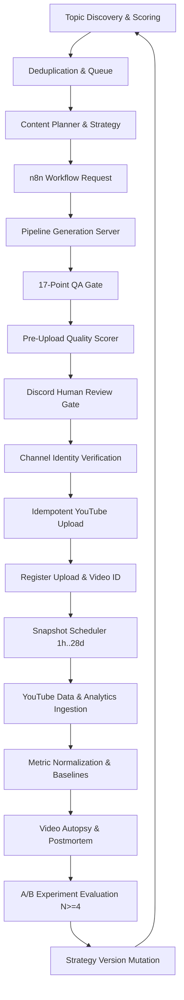

# End-to-End Growth Loop Trace & Source Map

This document traces every step of the closed-loop growth system from topic discovery to strategy evolution, identifying the exact source file, function, inputs, outputs, and failure handling at every stage.

---

## 🔄 Step-by-Step Code Execution Trace

---

### Step 1: Topic Discovery & Scoring
- **Source:** [`growth/topic_engine/topic_scorer.py`](file:///d:/Projects/yt-automations/growth/topic_engine/topic_scorer.py)
- **Function:** `score_topic(topic_text, channel_id, category)`
- **Input:** Topic concept string, channel target (`channel_a` or `channel_b`), content pillar category.
- **Output:** Structured dictionary `{ "final_score": float, "breakdown": { "audience_fit": float, "historical_performance": float, "novelty": float, "expected_retention": float, "production_ease": float } }`.
- **Failure Behavior:** If category or channel is unknown, defaults to baseline weights without crashing.

### Step 2: Deduplication & Lifecycle Queue
- **Source:** [`growth/topic_engine/deduplicator.py`](file:///d:/Projects/yt-automations/growth/topic_engine/deduplicator.py) & [`topic_lifecycle.py`](file:///d:/Projects/yt-automations/growth/topic_engine/topic_lifecycle.py)
- **Function:** `is_duplicate_topic(candidate, existing_topics, threshold=0.65)` and `TopicLifecycleManager.add_candidate_topic()`
- **Input:** Candidate string and list of published/queued topic strings.
- **Output:** Boolean `(is_duplicate, matched_topic)` and new `topic_id` in `topic_candidates` table with status `'QUEUED'`.
- **Failure Behavior:** Raises `ValueError("Duplicate topic detected")` and prevents duplicate queueing.

### Step 3: Content Planning & Strategy Assignment
- **Source:** [`growth/planner/content_planner.py`](file:///d:/Projects/yt-automations/growth/planner/content_planner.py)
- **Function:** `ContentPlanner.plan_next_video(channel_id)`
- **Input:** Channel identifier (`channel_a` or `channel_b`).
- **Output:** Rich `NEXT_VIDEO_PLAN` JSON containing topic, category, cluster, active strategy version, assigned experiment ID, variant parameters, target duration, and selection reason.
- **Failure Behavior:** Falls back to core default channel topics if queue is empty.

### Step 4: n8n Workflow Request Bridge
- **Source:** [`growth/server.py`](file:///d:/Projects/yt-automations/growth/server.py) & [`growth/n8n-workflows/n8n_growth_intelligence_loop.json`](file:///d:/Projects/yt-automations/growth/n8n-workflows/n8n_growth_intelligence_loop.json)
- **Endpoint:** `GET /api/growth/plan-next?channel=channel_a`
- **Output:** Returns `{ "status": "success", "plan": {...} }`.
- **Failure Behavior:** Returns HTTP 500 with error message in JSON format.

### Step 5: Production Video Generation
- **Source:** Pipeline 1 (`alternate-history-shorts/server_alt_history.py`) or Pipeline 2 (`convo-shorts/yt-automation-engine/server.py`)
- **Endpoints:** `POST /generate-alternate-history` (Port 8000) or `POST /tts` (Port 5001)
- **Execution:** Generates script, RAG historical grounding, voiceover, Whisper alignments, Fooocus SDXL scenes, Ken Burns Candidate A animation, audio mix, and subtitles.
- **Failure Behavior:** Fails build, logs error, and marks job `FAILED`.

### Step 6: 17-Point QA Gate
- **Source:** [`alternate-history-shorts/scripts/qa_checks.py`](file:///d:/Projects/yt-automations/alternate-history-shorts/scripts/qa_checks.py)
- **Function:** `run_all_qa_checks(video_id)`
- **Input:** Generated video file, scene plan, audio waveforms, manifest.
- **Output:** 17/17 QA PASS checklist.
- **Failure Behavior:** Fatal rejection if any check fails; blocks publishing.

### Step 7: Pre-Upload Quality Scorer
- **Source:** [`growth/quality/quality_scorer.py`](file:///d:/Projects/yt-automations/growth/quality/quality_scorer.py)
- **Function:** `evaluate_content_quality(features, qa_results, evidence_status)`
- **Output:** 10-dimension breakdown and composite quality score (0-10).
- **Rule:** Quality score NEVER overrides QA gate failures.

### Step 8: Discord Human Review Gate
- **Source:** [`alternate-history-shorts/scripts/discord_review.py`](file:///d:/Projects/yt-automations/alternate-history-shorts/scripts/discord_review.py)
- **Function:** Posts 540x960 review proxy to Discord webhook and waits for operator command (`approve <video_id>` / `reject <video_id>`).
- **Failure Behavior:** If rejected, job status transitions to `'REJECTED'` and execution stops.

### Step 9: Pre-Upload Channel Identity Verification
- **Source:** [`growth/channels/channel_identity_check.py`](file:///d:/Projects/yt-automations/growth/channels/channel_identity_check.py)
- **Function:** `enforce_channel_match(pipeline_name, authenticated_channel_id, authenticated_channel_name)`
- **Input:** Configured expected Google Channel ID vs live authenticated ID from OAuth.
- **Output:** None on match; raises fatal `RuntimeError` on mismatch.
- **Failure Behavior:** Upload halts immediately before calling YouTube API.

### Step 10: Idempotent YouTube Upload
- **Source:** [`alternate-history-shorts/scripts/upload_video.py`](file:///d:/Projects/yt-automations/alternate-history-shorts/scripts/upload_video.py) / [`uploader.py`](file:///d:/Projects/yt-automations/convo-shorts/yt-automation-engine/uploader.py)
- **Function:** `upload_video_to_youtube(...)`
- **Output:** Public YouTube Video ID and URL (`https://youtu.be/...`).
- **Failure Behavior:** Idempotency checks against manifest prevent duplicate uploads.

### Step 11: Register Video & Queue Snapshots
- **Source:** [`growth/server.py`](file:///d:/Projects/yt-automations/growth/server.py)
- **Endpoint:** `POST /api/growth/record-upload`
- **Action:** Inserts video record into `videos` table in `growth.db` and records `publish_timestamp`.

### Step 12: Scheduled Performance Snapshot Ingestion
- **Source:** [`growth/analytics/snapshot_scheduler.py`](file:///d:/Projects/yt-automations/growth/analytics/snapshot_scheduler.py)
- **Function:** `SnapshotScheduler.run_pending_snapshot_checks()`
- **Action:** Scans due snapshot windows (`1h`, `6h`, `24h`, `48h`, `7d`, `28d`) and calls `YouTubeApiCollector.fetch_and_record_snapshot()`.
- **Failure Behavior:** If API quota is exhausted, tags data source as `SIMULATION_FALLBACK` or preserves existing snapshot.

### Step 13: Metric Normalization & Baselines
- **Source:** [`growth/analytics/normalizer.py`](file:///d:/Projects/yt-automations/growth/analytics/normalizer.py)
- **Function:** `normalize_video_metrics(snapshot, baseline)`
- **Output:** Normalized view velocity, retention factor, and composite relative score.

### Step 14: Video Autopsy & Postmortem Analysis
- **Source:** [`growth/learning/autopsy_analyzer.py`](file:///d:/Projects/yt-automations/growth/learning/autopsy_analyzer.py)
- **Function:** `generate_video_autopsy(video_id, features, summary)`
- **Output:** Classification (`ABOVE_MEDIAN`, `BELOW_MEDIAN`, `ON_MEDIAN`) with positive/negative signals.

### Step 15: A/B Experiment Evaluation ($N \ge 4$)
- **Source:** [`growth/experiments/experiment_manager.py`](file:///d:/Projects/yt-automations/growth/experiments/experiment_manager.py)
- **Function:** `ExperimentManager.evaluate_experiment(exp_id, control_obs, variant_obs)`
- **Output:** `{ "status": "EVALUATED", "decision": "ACCEPT_VARIANT", "confidence": "HIGH" }`.
- **Failure Behavior:** Returns `status="INSUFFICIENT_DATA"` if $N < 4$.

### Step 16: Strategy Version Mutation
- **Source:** [`growth/learning/learning_engine.py`](file:///d:/Projects/yt-automations/growth/learning/learning_engine.py)
- **Function:** `LearningEngine._promote_strategy(channel_id, experiment_result, supporting_vids)`
- **Action:** Writes `strategy_v1.1` to `strategy_versions` table, records `STRATEGY_MUTATION` in `learning_events`, and informs future content planner calls.
