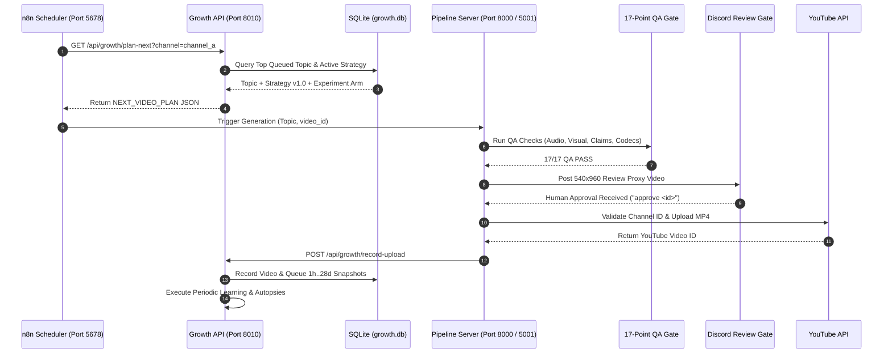

# Growth System Technical Implementation Guide

---

## 🏛️ 1. Module Overview & Source Map

The Content Intelligence and Closed-Loop Learning System is organized into 8 modular subpackages inside `growth/`:

```text
growth/
├── db/
│   ├── schema.sql                     # Relational SQLite schema (WAL mode, FKs, constraints)
│   ├── database.py                   # Context-managed connection pool
│   └── models.py                     # Dataclasses & CRUD repository (8 entities + Jobs)
├── channels/
│   ├── channel_identity_check.py     # Pre-upload OAuth channel identity validator
│   └── ../config/channels/           # Dedicated non-secret channel profiles
├── features/
│   ├── schema.py                     # 16+ measurable feature keys
│   ├── feature_extractor_p1.py       # Pipeline 1 feature parser
│   └── feature_extractor_p2.py       # Pipeline 2 feature parser
├── analytics/
│   ├── youtube_api_collector.py      # Real YouTube Data v3 & Analytics v2 ingestion
│   ├── mock_data_generator.py        # Multi-window offline simulator (1h..28d)
│   └── normalizer.py                 # 10-video median normalizer & composite score
├── topic_engine/
│   ├── topic_scorer.py               # Explainable topic_score_v1 formula
│   ├── deduplicator.py               # Token Jaccard similarity threshold (0.65)
│   ├── topic_pool.py                 # 70/20/10 portfolio allocator
│   └── topic_lifecycle.py            # 9-state topic candidate machine
├── strategy/
│   ├── strategy_manager.py           # Immutable version loader & validator
│   ├── channel_a_strategy_v1.json    # Channel A baseline strategy
│   └── channel_b_strategy_v1.json    # Channel B baseline strategy
├── experiments/
│   ├── registry.py                   # Predefined A/B hypothesis definitions
│   └── experiment_manager.py         # Sample size guard (N >= 4) & delta evaluator
├── learning/
│   ├── autopsy_analyzer.py           # Structured postmortem classifier
│   ├── report_generator.py           # Markdown weekly report builder
│   └── learning_engine.py            # Learning loop & strategy version promoter
├── planner/
│   └── content_planner.py            # Next video planning synthesizer
├── server.py                         # REST API Bridge on Port 8010 for n8n
├── cli.py                            # Master operations CLI & ASCII dashboard
└── run_growth_tests.py               # Discovery test runner (27 tests)
```

---

## 🔄 2. Complete Execution Trace


