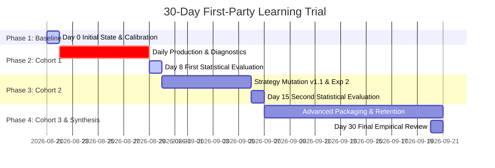

# 30-DAY LIVE FIRST-PARTY LEARNING TRIAL PROTOCOL
**System:** YouTube Automation + Growth Intelligence  
**Channels:** Channel A (`Chronos Shift` / Alternate History) & Channel B (`Debate Protocol` / Convo Shorts)  
**Branch:** `feature/growth-intelligence`  
**Execution Date:** August 21, 2026 – September 20, 2026  
**Target Cadence:** 1 approved video / day / channel (~7 videos/week/channel, ~60 videos total)

---

## 1. Objective of the 30-Day Operational Trial

The objective is to prove that the Growth Intelligence system operates as an empirical feedback loop where **real first-party YouTube data** directly informs subsequent content decisions:

$$\text{UPLOAD} \longrightarrow \text{OBSERVE REAL YOUTUBE DATA} \longrightarrow \text{DIAGNOSE} \longrightarrow \text{UPDATE BELIEFS} \longrightarrow \text{BALANCE NEXT ARM} \longrightarrow \text{PRODUCE} \longrightarrow \text{REPEAT}$$

The trial proves that the Brain improves content performance over time through controlled single-variable experimentation, rather than producing internally consistent but empirically ungrounded actions.

---

## 2. Live Experiments Under Test

### Channel A (`Chronos Shift`)
* **Experiment ID:** `exp_channel_a_hook_structure_counterfactual_question_v1`
* **Variable Under Test:** `HOOK_STRUCTURE`
* **Control Arm:** Baseline Question Hook (*"What if Rome never fell?"*)
* **Treatment Arm:** Counterfactual Statement Hook with Whisper-aligned visual beat (*"In 476 AD, the Roman Empire was erased in a single night. What if..."*)
* **Target Sample Size:** $N \ge 4$ mature ($7d+$) samples per arm (8 mature videos total)

### Channel B (`Debate Protocol`)
* **Experiment ID:** `exp_channel_b_hook_structure_socratic_question_v1`
* **Variable Under Test:** `HOOK_STRUCTURE`
* **Control Arm:** Baseline Direct Provocation Hook (*"Why your brain forgets names in three seconds"*)
* **Treatment Arm:** Socratic Paradox Hook (*"If you can remember an embarrassing moment from 10 years ago, why do you forget a name in 3 seconds?"*)
* **Target Sample Size:** $N \ge 4$ mature ($7d+$) samples per arm (8 mature videos total)

---

## 3. Strict Invariant Specification (Single-Variable Discipline)

To prevent multi-variable confounding, all non-experiment generation parameters are locked:

| Dimension | Channel A Invariant | Channel B Invariant |
|---|---|---|
| **Voice Narration** | `ChristopherNeural` (+0Hz, +0% rate) | Dual Piper: Ryan (Host A) & Samantha (Host B) |
| **Visual Architecture** | SDXL Photorealistic oil/cinematic via Fooocus | Dynamic split-host avatar framing over motion background |
| **Pacing / Visual Beat** | 3.2s average duration, zero freeze | Fast conversational cadence (165 wpm) |
| **Subtitles** | Whisper ASS Dynamic, yellow emphasis | Kinetic speaker-colored pop (Host A: Cyan, Host B: Yellow) |
| **Audio Mix** | -22dB background music ducking | -24dB ambient debate score ducking |
| **Duration Target** | 42s – 50s | 42s – 50s |
| **Topic Category Lock** | Matched high-potential history turning points | Matched high-potential psychology / philosophy paradoxes |
| **QA Gate** | 17/17 automated validation checks | 16/16 automated validation checks |
| **Human Review** | Mandatory Discord `Approve`/`Reject` | Mandatory Discord `Approve`/`Reject` |

---

## 4. 30-Day Operational Trial Timeline



### Day 0: Initial State & Baseline
* Channel A: Strategy `v1.0`, Treatment = 1 (`video_alexandria_exp_01`, YT: `SEjKTQpHOOU`), Control = 0.
* Channel B: Strategy `v1.0`, Treatment = 0, Control = 0.
* DO_NOT_USE Registry: Clean.

### Days 1–7: Production & Continuous Diagnostics
* Daily Cadence: 1 video/day/channel.
* Snapshots collected: 1h, 6h, 24h, 48h.
* Learning Engine emits `VIDEO_DIAGNOSTIC` events.
* **Invariant Guard:** Zero strategy mutations allowed ($N < 4$ per arm).
* **Dynamic Arm Balancer:** Alternates `CONTROL` and `TREATMENT` to keep sample balance 1:1.

### Days 8–14: First Cohort Maturity & Strategic Evaluation
* At Day 8: Videos from Days 1–4 reach 7-day maturity ($N=4$ Control, $N=4$ Treatment).
* `MultiArmExperimentEvaluator` executes with Median APV comparison and MAD outlier protection:
  - If $\Delta \ge +5.0\% \implies$ **PROMOTED** $\to$ Create Strategy `v1.1`.
  - If $\Delta \le -5.0\% \implies$ **REJECTED** $\to$ Record `FIRST_PARTY_OVERRIDE` and add pattern to `DO_NOT_USE`.
  - If $|\Delta| < 5.0\% \implies$ **INCONCLUSIVE** $\to$ Retain Control baseline.
* 7-day strategy mutation cooldown begins.

### Days 15–21: Second Cohort & Variable Advancement
* Advance to the next variable in the hierarchy:
  1. `HOOK_STRUCTURE` (Validated / Resolved)
  2. `TOPIC_CLUSTER` (Next variable: Modern Warfare vs Ancient Turning Points)
  3. `PACING_RHYTHM` (2.8s vs 3.5s visual beat)
  4. `ENDING_CTA` (Socratic question vs Echo statement)

### Days 22–30: Empirical Benchmark & Longitudinal Analysis
* Compare 28-day evergreen snapshots against initial channel baselines.
* Evaluate whether Strategy `v1.1` and `v1.2` generated higher median retention (APV) and view velocity than Strategy `v1.0`.

---

## 5. Causal Learning Trace Framework

Every video generated by the system is linked to a permanent 9-point causal trace:

```json
{
  "video_id": "vid_channel_a_day_08",
  "channel_id": "channel_a",
  "why_topic": "Selected from high-scoring cluster based on first-party baseline APV.",
  "why_hook": "Testing TREATMENT spec for HOOK_STRUCTURE: Counterfactual question hook.",
  "why_arm_assignment": "Cohort balance required TREATMENT arm to maintain 1:1 balance towards N >= 4 decision threshold.",
  "supporting_evidence": ["24h diagnostic on video_alexandria_exp_01 indicated early drop-off with standard hook."],
  "influencing_prior_videos": ["video_alexandria_exp_01", "vid_channel_a_day_02"],
  "locked_invariants": ["Voice Profile", "SDXL Art Style", "Duration Target", "QA 17/17"],
  "maturity_tier": "PRELIMINARY",
  "diagnostic_summary": {
    "hook_signal": "POSITIVE",
    "topic_signal": "HIGH_DEMAND",
    "pacing_signal": "OPTIMAL_RETENTION"
  },
  "what_brain_learned": ["Counterfactual phrasing sustained attention through Beat 1."],
  "subsequent_decisions_impact": "Preserved hook structure for subsequent treatment samples; assigned CONTROL to next job."
}
```

---

## 6. Daily Operator Checklist

1. **Check Live Trial Status:**
   ```powershell
   python growth/cli.py --live-learning-status channel_a
   python growth/cli.py --live-learning-status channel_b
   ```
2. **Collect Due Snapshots:**
   ```powershell
   python growth/cli.py --check-snapshots
   ```
3. **Inspect Next Production Recommendation:**
   ```powershell
   python growth/cli.py --brain-production-plan channel_a
   python growth/cli.py --brain-production-plan channel_b
   ```
4. **Execute Video Render & Automated QA.**
5. **Review Render in Discord:** Click `Approve` (or `Reject`).
6. **Upload to YouTube & Verify Idempotent Registration.**
7. **End-of-Week Review:**
   ```powershell
   python growth/cli.py --weekly-learning channel_a
   python growth/cli.py --weekly-learning channel_b
   ```
