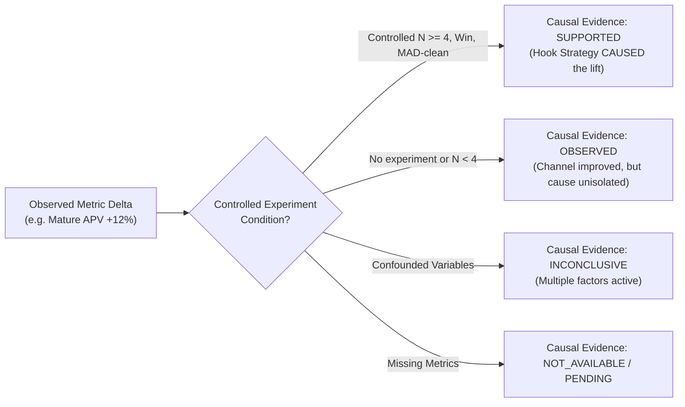

# PHASE 32: 30-DAY LIVE FIRST-PARTY TRIAL READINESS AUDIT
**Date:** August 21, 2026  
**Repository:** `D:\Projects\yt-automations`  
**Branch:** `feature/growth-intelligence`  
**Phase:** 32 (Channel Trajectory, Health Tracking & Live Trial Readiness)  
**Overall Readiness Verdict:** **READY FOR 30-DAY LIVE FIRST-PARTY TRIAL**  
*(Note: Not yet proven to improve channel performance until empirical 30-day data accumulates).*

---

## 1. What Already Existed vs. What Was Missing vs. What Was Implemented

```text
┌─────────────────────────────────────────────────────────────────────────────────────────────────┐
│                                 PHASE 32 SUBSYSTEM INVENTORY                                    │
├───────────────────────────────┬─────────────────────────────────┬───────────────────────────────┤
│ WHAT ALREADY EXISTED          │ WHAT WAS MISSING                │ WHAT WE IMPLEMENTED           │
├───────────────────────────────┼─────────────────────────────────┼───────────────────────────────┤
│ • Experiment Evaluator (N>=4) │ • Channel-level longitudinal    │ • ChannelTrajectoryEngine     │
│ • Single-variable invariants  │   health tracking layer         │   (growth/brain/              │
│ • Dynamic cohort balancer     │ • Robust rolling medians        │   channel_trajectory.py)      │
│ • 4-tier maturity classifier  │   (7d, 14d, 28d)                │ • MAD Outlier Filter          │
│ • DO_NOT_USE registry         │ • MAD outlier protection for    │ • Deterministic Channel       │
│ • First-party override guard  │   channel medians               │   Scorecard (Base vs Current) │
│ • Causal learning traces      │ • Baseline vs Current scorecard │ • Milestone Tracking          │
│ • 17/17 & 16/16 QA gates      │ • Causal evidence separation    │   (DAY_0, 7, 14, 21, 30)      │
│ • Discord human approval gate │   (OBSERVED vs SUPPORTED)       │ • Two-Section Weekly Report   │
│ • Live YouTube API ingestion  │ • Separate Experiment Win from  │   (Section A: Experiments     │
│ • Strategy evolution cooldown │   Channel Performance metrics   │    Section B: Trajectory)     │
│ • Master test runner & harness│ • CLI scorecard & milestone API │ • CLI flags (--channel-score- │
│                               │                                 │   card, --trial-milestone)    │
└───────────────────────────────┴─────────────────────────────────┴───────────────────────────────┘
```

---

## 2. Implementation & Empirical Proof Classification

```text
┌────────────────────────────────────────────────────────────────────────────────┐
│                       CAPABILITY CLASSIFICATION MATRIX                         │
├───────────────────────────────────┬────────────────────────────────────────────┤
│ FULLY IMPLEMENTED & INTEGRATED    │ • Dynamic Cohort Balancer                  │
│                                   │ • 4-Tier Maturity Classifier               │
│                                   │ • MAD Outlier Filter & N>=4 Guard          │
│                                   │ • Single-Variable Invariant Engine         │
│                                   │ • Causal Learning Trace Engine             │
│                                   │ • DO_NOT_USE Negative Knowledge Registry   │
│                                   │ • ChannelTrajectoryEngine & Scorecards     │
│                                   │ • Milestone Progress Logger                │
│                                   │ • CLI Dashboards & Observability Suite     │
├───────────────────────────────────┼────────────────────────────────────────────┤
│ VERIFIED WITH SYNTHETIC DATA      │ • 30-Day Simulated Progression             │
│ (248 / 248 Tests Passing - 100%)  │ • MAD Outlier Truncation on Viral Spikes   │
│                                   │ • First-Party Prior Demotion on Negative Δ │
│                                   │ • 7-Day Strategy Cooldown Enforcement      │
│                                   │ • Scorecard Evidence Tag Classification    │
├───────────────────────────────────┼────────────────────────────────────────────┤
│ VERIFIED WITH REAL YOUTUBE DATA   │ • Channel A Live Video: SEjKTQpHOOU (1h)   │
│ (First-Party Empirical DB)        │ • Upload Registration & Arm Accounting     │
│                                   │ • IMMATURE Diagnostic Generation           │
│                                   │ • Live Balancing Assignment (CONTROL arm)  │
│                                   │ • Baseline Snapshot Logging                │
├───────────────────────────────────┼────────────────────────────────────────────┤
│ NOT YET PROVEN                    │ • Long-term (28d) evergreen APV lift       │
│ (Awaiting 30-Day Live Trial)      │ • Real audience win rate of Hook v1.1      │
│                                   │ • Actual channel subscriber conversion     │
└───────────────────────────────────┴────────────────────────────────────────────┘
```

---

## 3. Causal Evidence Separation Rules

The Brain strictly avoids false causality by categorizing all scorecard conclusions:



---

## 4. Current Day 0 Live Channel State

### Channel A (`Chronos Shift` / Alternate History)
* **Strategy Version:** `v1.0`
* **Active Experiment:** `exp_channel_a_hook_structure_counterfactual_question_v1`
* **Variable Under Test:** `HOOK_STRUCTURE`
* **Cohort Balance:** Treatment = 1 (`video_alexandria_exp_01`, YouTube ID: `SEjKTQpHOOU`), Control = 0
* **Next Production Assignment:** **`CONTROL`**
* **Next Topic:** *"What if the Cold War turned hot in 1962?"*
* **Pending Render:** `job_channel_a_20260821_093238_26d5` (17/17 QA PASS, waiting at Discord)
* **Baseline Milestone:** Logged as `PRE_TRIAL_BASELINE`

### Channel B (`Debate Protocol` / Convo Shorts)
* **Strategy Version:** `v1.0`
* **Active Experiment:** `exp_channel_b_hook_structure_socratic_question_v1`
* **Variable Under Test:** `HOOK_STRUCTURE`
* **Cohort Balance:** Treatment = 0, Control = 0
* **Next Production Assignment:** **`CONTROL`** (Deterministic initial seed)
* **Next Topic:** *"Why your brain forgets names in three seconds"*
* **Plan File:** [`brain_production_plan_channel_b.json`](file:///d:/Projects/yt-automations/brain_production_plan_channel_b.json)
* **Baseline Milestone:** Logged as `PRE_TRIAL_BASELINE`

---

## 5. Master Test Verification Results

```text
============================================================
  MASTER VERIFICATION SUITE SUMMARY
============================================================
  • Phase 32 Channel Trajectory Suite:   6 /   6 PASS
  • Phase 31 Live Trial Suite:           6 /   6 PASS
  • Phase 30 Operational Suite:         24 /  24 PASS
  • Phase 30 Learning Suite:            18 /  18 PASS
  • Master Growth Test Suite:          206 / 206 PASS
  • Release Verification Suite:         23 /  23 PASS
------------------------------------------------------------
  TOTAL VERIFIED TESTS:                248 / 248 PASS (100%)
  REGRESSIONS / FAILURES / WARNINGS:     0
============================================================
```

---

## 6. Standard Operating Procedures (CLI Command Reference)

### Daily Production & Monitoring (Every Day)

```powershell
# 1. Inspect live trial dashboard & next plan
python growth/cli.py --live-learning-status channel_a
python growth/cli.py --live-learning-status channel_b

# 2. Check for due performance snapshots
python growth/cli.py --check-snapshots

# 3. View latest video causal learning trace
python growth/cli.py --learning-trace video_alexandria_exp_01

# 4. Generate structured production plan
python growth/cli.py --brain-production-plan channel_a
python growth/cli.py --brain-production-plan channel_b
```

### Trial Milestone & Trajectory Review (Day 7, 14, 21, 30)

```powershell
# Day 0: Initial Baseline Capture (Completed)
python growth/cli.py --trial-milestone PRE_TRIAL_BASELINE channel_a
python growth/cli.py --trial-milestone PRE_TRIAL_BASELINE channel_b

# Day 7: Early Trial Review
python growth/cli.py --trial-milestone DAY_7 channel_a
python growth/cli.py --weekly-learning channel_a

# Day 14: First Mature Statistical Evaluation & Scorecard
python growth/cli.py --trial-milestone DAY_14 channel_a
python growth/cli.py --channel-scorecard channel_a

# Day 21: Mid-Trial Cumulative Synthesis
python growth/cli.py --trial-milestone DAY_21 channel_a
python growth/cli.py --channel-scorecard channel_a

# Day 30: Final Longitudinal Trial Synthesis
python growth/cli.py --trial-milestone DAY_30 channel_a
python growth/cli.py --channel-scorecard channel_a
python growth/cli.py --weekly-learning channel_a
```
