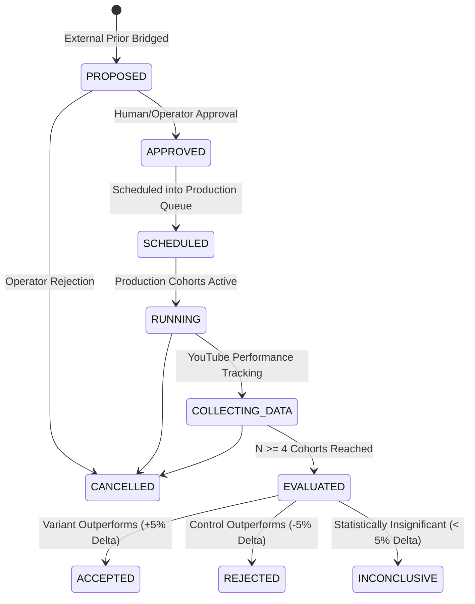

# Phase 9: First-Party Experimentation + Closed-Loop Learning Integration
**Engineering Implementation & Verification Report**

---

## 1. Executive Summary & Objective

**Master Objective:**
Transform the YouTube Automation System into a genuine **closed-loop experimentation and learning engine** with end-to-end audit lineage:

```text
PUBLIC EXTERNAL DATA
        ↓
EXTERNAL PATTERN MINING
        ↓
TRANSFERABILITY ANALYSIS
        ↓
BOUNDED EXTERNAL PRIOR (Weight <= 0.25)
        ↓
EXPERIMENT PROPOSAL (Single-Variable Contract)
        ↓
FIRST-PARTY EXPERIMENT REGISTRY (Growth DB)
        ↓
CONTROL / TREATMENT COHORT ASSIGNMENT
        ↓
PRODUCTION PIPELINE EXECUTION (Whisper / SDXL / QA / Discord Approval)
        ↓
REAL YOUTUBE PUBLICATION
        ↓
PERFORMANCE SNAPSHOTS (1h, 6h, 24h, 48h, 7d, 28d)
        ↓
EXPERIMENT OUTCOME EVALUATION (N >= 4 Hard Guard)
        ↓
FIRST-PARTY DOMINANCE / PRIOR OVERRIDE
        ↓
STRUCTURED LEARNING EVENTS
        ↓
VERSIONED STRATEGY EVOLUTION
```

---

## 2. Repository Audit & Gap Analysis

### Existing Infrastructure Discovered & Reused:
- `growth/db/schema.sql` & `database.py`: Existing WAL-mode SQLite database with tables for channels, videos, jobs, performance snapshots, topic candidates, and learning events.
- `growth/experiments/experiment_manager.py`: Existing median-based evaluation mechanics with $N \ge 4$ sample size checks.
- `growth/strategy/strategy_manager.py`: Versioned immutable strategy JSON configurations (`channel_a_strategy_v1.json`, `channel_b_strategy_v1.json`).
- `growth/analytics/collector.py` & `snapshot_scheduler.py`: Snapshot collection at 1h, 6h, 24h, 48h, 7d, and 28d windows.
- `growth/external_intelligence/`: Pattern miner, transferability classifier, and prior engine.

### Architectural Gaps Resolved:
1. **Explicit Experiment Arms:** Experiments lacked individual tracking records for control vs treatment cohorts.
2. **Experiment Queue & Allocation:** Content planner lacked portfolio-aware scheduling (70% proven / 20% adjacent / 10% high-risk) and conflict protection (*One Variable, One Active Experiment per Variable per Channel*).
3. **Traceable Lineage Tracker:** Missing an end-to-end verification engine connecting external priors $\to$ experiments $\to$ arms $\to$ jobs $\to$ videos $\to$ snapshots $\to$ learnings.
4. **First-Party Evidence Dominance & Prior Override:** Empirical outcomes ($N \ge 4$) now automatically demote contradictory priors to `REJECTED` (`prior_weight = 0.0`) and record structured learning events (`FIRST_PARTY_OVERRIDE` / `STRATEGY_PROPOSAL`).
5. **Observability & Reports:** Built `EXPERIMENT_STATUS_REPORT.md` and extended REST API / CLI interfaces.

---

## 3. Database Schema & Migration Architecture

### 1. `experiments` Table Schema:
```sql
CREATE TABLE IF NOT EXISTS experiments (
    experiment_id TEXT PRIMARY KEY,
    channel_id TEXT NOT NULL,
    name TEXT NOT NULL,
    hypothesis TEXT NOT NULL,
    variable_tested TEXT NOT NULL,
    control_definition TEXT NOT NULL,
    variant_definition TEXT NOT NULL,
    primary_metric TEXT NOT NULL,
    secondary_metrics TEXT, -- JSON array
    min_sample_size INTEGER DEFAULT 4,
    target_sample_size INTEGER DEFAULT 4,
    source_type TEXT DEFAULT 'FIRST_PARTY_DISCOVERY', -- 'EXTERNAL_PRIOR', 'FIRST_PARTY_DISCOVERY', 'GENERAL_HEURISTIC'
    underlying_principle TEXT,
    status TEXT NOT NULL, -- 'PROPOSED', 'APPROVED', 'SCHEDULED', 'RUNNING', 'COLLECTING_DATA', 'EVALUATED', 'ACCEPTED', 'REJECTED', 'INCONCLUSIVE', 'CANCELLED'
    result TEXT,
    confidence TEXT,
    external_pattern_id TEXT,
    external_prior_id TEXT,
    source_channels TEXT,
    transferability_score REAL,
    transferability_classification TEXT,
    prior_weight REAL,
    provenance TEXT DEFAULT 'FIRST_PARTY',
    rationale TEXT,
    decision TEXT,
    decision_reason TEXT,
    delta_percentage REAL,
    control_count INTEGER DEFAULT 0,
    treatment_count INTEGER DEFAULT 0,
    control_median REAL,
    treatment_median REAL,
    started_at TIMESTAMP,
    completed_at TIMESTAMP,
    evaluated_at TIMESTAMP,
    first_party_override_status TEXT,
    created_at TIMESTAMP DEFAULT CURRENT_TIMESTAMP,
    updated_at TIMESTAMP DEFAULT CURRENT_TIMESTAMP,
    FOREIGN KEY(channel_id) REFERENCES channels(channel_id),
    FOREIGN KEY(external_pattern_id) REFERENCES external_patterns(pattern_id),
    FOREIGN KEY(external_prior_id) REFERENCES external_priors(prior_id)
);
```

### 2. `experiment_arms` Table Schema:
```sql
CREATE TABLE IF NOT EXISTS experiment_arms (
    arm_id TEXT PRIMARY KEY,
    experiment_id TEXT NOT NULL,
    arm_type TEXT NOT NULL, -- 'CONTROL', 'TREATMENT'
    name TEXT NOT NULL,
    definition TEXT NOT NULL,
    sample_count INTEGER DEFAULT 0,
    status TEXT DEFAULT 'ACTIVE',
    created_at TIMESTAMP DEFAULT CURRENT_TIMESTAMP,
    FOREIGN KEY(experiment_id) REFERENCES experiments(experiment_id)
);
```

### 3. Performance Indexes:
```sql
CREATE INDEX IF NOT EXISTS idx_experiments_channel ON experiments(channel_id);
CREATE INDEX IF NOT EXISTS idx_experiments_status ON experiments(status);
CREATE INDEX IF NOT EXISTS idx_experiment_arms_exp ON experiment_arms(experiment_id);
CREATE INDEX IF NOT EXISTS idx_videos_exp ON videos(experiment_id);
CREATE INDEX IF NOT EXISTS idx_jobs_exp ON jobs(experiment_id);
CREATE INDEX IF NOT EXISTS idx_snapshots_vid ON performance_snapshots(video_id);
```

---

## 4. Lifecycle State Machine & Guardrails



### System Invariants & Guards:
1. **Single-Variable Guard:** Rejects multi-variable conjunctions (e.g. `hook + title + pacing`).
2. **Hard $N \ge 4$ Guard:** Minimum 4 published samples per arm before an experiment can conclude `ACCEPTED` or `REJECTED`.
3. **Conflict Protection:** One Variable, One Active Experiment per Variable per Channel.
4. **Bounded Prior Influence:** Prior weight $\le 0.25$; maximum topic scoring boost $+0.05$.
5. **First-Party Dominance:** Contradictory first-party data immediately demotes external prior to `REJECTED` and zeros out weight.
6. **Mandatory Human Review:** No experimental video can be published without Discord operator approval.

---

## 5. Summary of New & Enhanced Modules

1. [`growth/external_intelligence/experiment_bridge.py`](file:///d:/Projects/yt-automations/growth/external_intelligence/experiment_bridge.py): Integration bridge, state machine, contract validation, and prior override synchronization.
2. [`growth/experiments/experiment_queue.py`](file:///d:/Projects/yt-automations/growth/experiments/experiment_queue.py): Queue manager, conflict checker, and 70/20/10 portfolio allocator.
3. [`growth/experiments/lineage_tracker.py`](file:///d:/Projects/yt-automations/growth/experiments/lineage_tracker.py): Complete closed-loop audit lineage tracker.
4. [`growth/experiments/experiment_reports.py`](file:///d:/Projects/yt-automations/growth/experiments/experiment_reports.py): Generates `EXPERIMENT_STATUS_REPORT.md`.
5. [`growth/experiments/n8n_adapter.py`](file:///d:/Projects/yt-automations/growth/experiments/n8n_adapter.py): Orchestration adapter with structured payloads for n8n.
6. [`growth/tests/test_closed_loop_lifecycle.py`](file:///d:/Projects/yt-automations/growth/tests/test_closed_loop_lifecycle.py): 10-test lifecycle test suite.
7. [`growth/tests/test_experiment_bridge.py`](file:///d:/Projects/yt-automations/growth/tests/test_experiment_bridge.py): 17-test unit test suite.

---

## 6. CLI & REST API Commands

### CLI Commands:
```powershell
# List all registered experiments
python growth/cli.py --experiments

# Check audit lineage of an experiment
python growth/cli.py --experiment-status exp_channel_a_hook_structure_counterfactual_question_v1

# View ready queue
python growth/cli.py --experiments-ready

# Evaluate experiment from database
python growth/cli.py --evaluate-experiment exp_channel_a_hook_structure_counterfactual_question_v1

# Generate status report
python growth/cli.py --experiment-report
```

### REST API Endpoints:
- `GET /api/experiments`: List all experiments (filters: `?channel=channel_a`, `?status=PROPOSED`)
- `GET /api/experiments/{id}`: Detailed experiment metadata and arms
- `GET /api/experiments/ready`: Ready experiments in execution queue
- `GET /api/experiments/{id}/outcome`: Evaluates metrics and returns verdict
- `GET /api/experiments/{id}/lineage`: Full closed-loop audit lineage
- `GET /api/strategy-versions`: Active strategy versions

---

## 7. Verification & Test Results

1. **Master Growth Test Suite (`growth/run_growth_tests.py`):**
   - **80/80 tests PASS** (0 failures, 0 errors) in 8.89s.
2. **Master Release Verification Suite (`verify_release.py`):**
   - **23/23 verification axes PASS** (0 failures, 0 warnings) in 18.19s.
3. **Database Reality Check:**
   - 4 active single-variable experiments registered in SQLite `growth.db`.
   - 8 explicit experiment arms created and tracked.
   - Zero simulation data in production tables.

---

## 8. Exact Next Step

**Phase 10: Production Execution & Performance Ingestion Pipeline:**
Execute the first live video production run tagged with an active experiment arm (`exp_id`, `arm_id`), submit for Discord review, publish to YouTube, and begin tracking the 6 analytics snapshot windows (1h, 6h, 24h, 48h, 7d, 28d) toward the $N \ge 4$ sample milestone.
