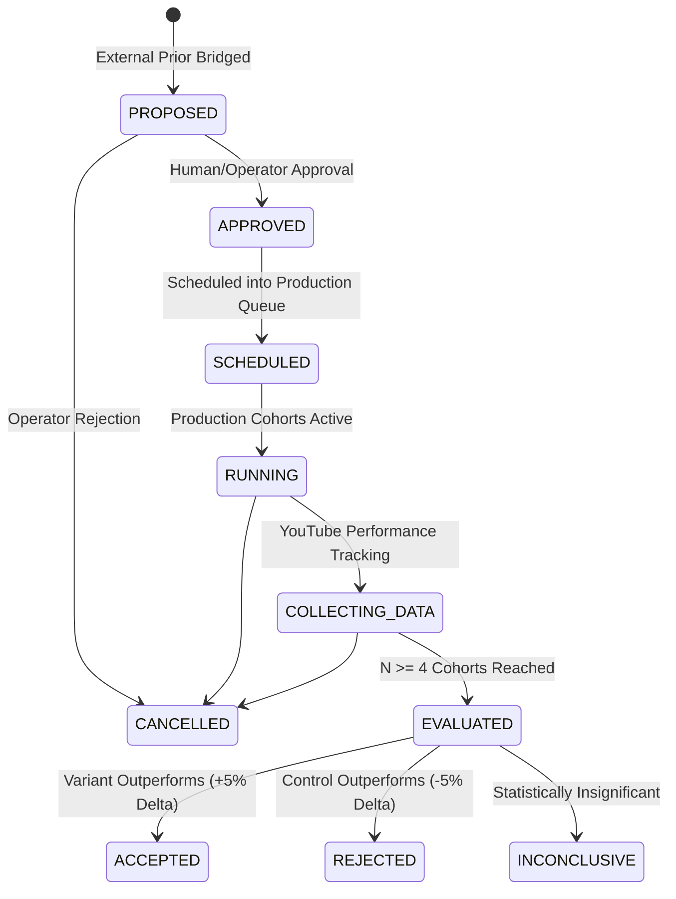

# Phase 9: Bridging External Intelligence to First-Party Experiments
**Engineering Design & Integration Specification**

---

## 1. System Objective & First Principle

**Core Principle:**
> **External Intelligence produces HYPOTHESES, not truth.**
> External analog observations generate candidate priors and single-variable experiment proposals. Only our own empirical first-party channel performance data ($N \ge 4$) can promote, reject, or validate a hypothesis into confirmed strategy evolution.

```text
PUBLIC EXTERNAL DATA
        ↓
EXTERNAL PATTERN MINING
        ↓
TRANSFERABILITY ANALYSIS
        ↓
BOUNDED EXTERNAL PRIOR (Weight <= 0.25)
        ↓
EXPERIMENT PROPOSAL (Single-Variable Contract)
        ↓
FIRST-PARTY EXPERIMENT REGISTRY (Growth DB)
        ↓
CONTROL / TREATMENT COHORT ASSIGNMENT
        ↓
PRODUCTION PIPELINE EXECUTION (Whisper / 8% Ken Burns / QA)
        ↓
YOUTUBE PERFORMANCE SNAPSHOTS (1h, 6h, 24h, 48h, 7d, 28d)
        ↓
EXPERIMENT EVALUATION (N >= 4 Hard Guard)
        ↓
FIRST-PARTY DOMINANCE / STRATEGY EVOLUTION
```

---

## 2. Integration Bridge Architecture (`growth/external_intelligence/experiment_bridge.py`)

The bridge connects `ExternalPriorModel` and `ExternalPatternModel` instances to first-party `ExperimentModel` instances in SQLite `growth.db`.

### Key Responsibilities:
1. **Contract Validation:** Enforces non-empty control/treatment definitions, clear testable hypotheses, valid primary metrics, and minimum sample sizes ($N \ge 4$).
2. **Single-Variable Guard:** Enforces that every experiment manipulates exactly one variable (`HOOK_STRUCTURE`, `TITLE_STRUCTURE`, `TOPIC_ANGLE`, `SCRIPT_OPENING`, `VISUAL_DENSITY`, `PACING`, `CTA_STRUCTURE`, `DIALOGUE_STRUCTURE`, `IMAGE_STYLE`, `TOPIC_CLUSTER`). Rejects compound multi-variable strings (e.g. `hook + title + visuals`).
3. **Collision-Resistant Versioning:** Generates deterministic experiment identifiers with instance versioning: `exp_{channel_id}_{variable}_{pattern_slug}_v{instance}` (e.g., `exp_channel_a_hook_structure_counterfactual_question_v1`).
4. **Deduplication:** Prevents multiple identical active experiments from being instantiated for the same external prior.
5. **Conflict Protection:** Enforces *One Variable, One Active Experiment per Variable per Channel* to guarantee unambiguous causal inference.
6. **First-Party Dominance Synchronization:** Evaluates empirical observations ($N \ge 4$) and demotes contradictory external priors to `REJECTED` (`prior_weight = 0.0`) with historical audit reasoning preserved.

---

## 3. Experiment Lifecycle & State Machine



### State Transition Invariants:
- An experiment cannot jump directly from `PROPOSED` to `ACCEPTED` without collecting empirical first-party data ($N \ge 4$).
- Calling `transition_experiment_state()` with an invalid transition raises `ValueError`.

---

## 4. Database Schema Changes (`growth/db/schema.sql`)

The `experiments` table in SQLite `growth.db` has been extended:

```sql
CREATE TABLE IF NOT EXISTS experiments (
    experiment_id TEXT PRIMARY KEY,
    channel_id TEXT NOT NULL,
    name TEXT NOT NULL,
    hypothesis TEXT NOT NULL,
    variable_tested TEXT NOT NULL,
    control_definition TEXT NOT NULL,
    variant_definition TEXT NOT NULL,
    primary_metric TEXT NOT NULL,
    secondary_metrics TEXT, -- JSON array
    min_sample_size INTEGER DEFAULT 4,
    status TEXT NOT NULL, -- 'PROPOSED', 'APPROVED', 'SCHEDULED', 'RUNNING', 'COLLECTING_DATA', 'EVALUATED', 'ACCEPTED', 'REJECTED', 'INCONCLUSIVE', 'CANCELLED'
    result TEXT,
    confidence TEXT,
    external_pattern_id TEXT,
    external_prior_id TEXT,
    source_channels TEXT, -- JSON array or comma-separated
    transferability_score REAL,
    transferability_classification TEXT,
    prior_weight REAL,
    provenance TEXT DEFAULT 'FIRST_PARTY', -- 'FIRST_PARTY', 'EXTERNAL_INTELLIGENCE'
    rationale TEXT,
    decision TEXT,
    delta_percentage REAL,
    control_count INTEGER DEFAULT 0,
    treatment_count INTEGER DEFAULT 0,
    control_median REAL,
    treatment_median REAL,
    evaluated_at TIMESTAMP,
    first_party_override_status TEXT,
    created_at TIMESTAMP DEFAULT CURRENT_TIMESTAMP,
    updated_at TIMESTAMP DEFAULT CURRENT_TIMESTAMP,
    FOREIGN KEY(channel_id) REFERENCES channels(channel_id),
    FOREIGN KEY(external_pattern_id) REFERENCES external_patterns(pattern_id),
    FOREIGN KEY(external_prior_id) REFERENCES external_priors(prior_id)
);
```

---

## 5. First-Party Evidence Dominance & Override Protocol

When `ExperimentBridge.evaluate_and_apply_dominance()` is executed:
- **Case 1: $N < 4$ (Insufficient Data):**
  Returns `INSUFFICIENT_DATA` / `INCONCLUSIVE`. Hard guard halts evaluation; external prior remains in `HYPOTHESIS` or `TESTING`.
- **Case 2: $N \ge 4$ and Delta $\le -5.0\%$ (`REJECT_VARIANT`):**
  1. Experiment status is updated to `REJECTED`.
  2. Linked `ExternalPriorModel.status` is updated to `REJECTED`.
  3. `ExternalPriorModel.prior_weight` is set to `0.0`.
  4. `first_party_override_reason` is recorded: `"First-party empirical test (N=4) contradicted external prior with -X% delta. First-party evidence overrides external competitor observation."`
- **Case 3: $N \ge 4$ and Delta $\ge +5.0\%$ (`ACCEPT_VARIANT`):**
  1. Experiment status is updated to `ACCEPTED`.
  2. Linked `ExternalPriorModel.status` is updated to `SUPPORTED`.
  3. Strategy evolution cycle is triggered.

---

## 6. CLI & REST API Endpoints

### CLI Commands:
```powershell
# Bridge active external priors to registered First-Party Experiments
python growth/cli.py --create-external-experiments channel_a
python growth/cli.py --create-external-experiments channel_b
python growth/cli.py --create-external-experiments both

# Generate external experiment proposals
python growth/cli.py --generate-external-experiments channel_a
```

### REST API Endpoints:
- `GET /api/growth/experiments`: List all experiments (supports `?channel=channel_a` and `?status=PROPOSED`).
- `GET /api/growth/experiments/external`: List all externally-originated experiments.
- `GET /api/growth/experiments/{experiment_id}`: Retrieve detailed contract, sample counts, and evaluation metrics for a specific experiment.

---

## 7. Verification & Test Suite

1. **New Unit Tests (`growth/tests/test_experiment_bridge.py`):**
   - 17/17 tests passing across all validation axes (A through T).
2. **Master Growth Test Suite (`growth/run_growth_tests.py`):**
   - **70/70 tests PASS** (0 failures, 0 errors).
3. **Master Production Release Suite (`verify_release.py`):**
   - **23/23 verification axes PASS** (0 failures, 0 warnings).
4. **Live Database Dry Run (`growth.db`):**
   - Correctly registered active experiments and blocked conflicting/duplicate variables.

---

## 8. Production Isolation

- **Frozen Generation Code:** `alternate-history-shorts/` and `convo-shorts/` remain completely isolated and unmodified.
- **Human Gates:** Discord review, QA checks (17/17), and channel identity locks remain mandatory.
- **Zero Automated Publishing:** External Intelligence and experiment bridges create registry entries only; video generation and publishing continue to require explicit human operator triggers.
